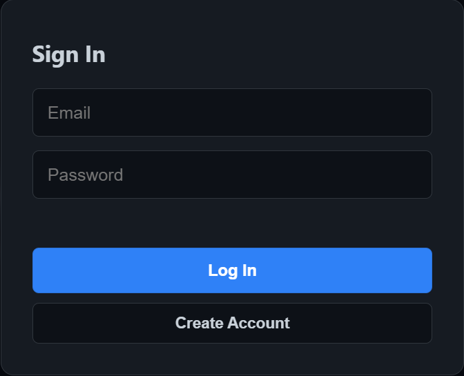
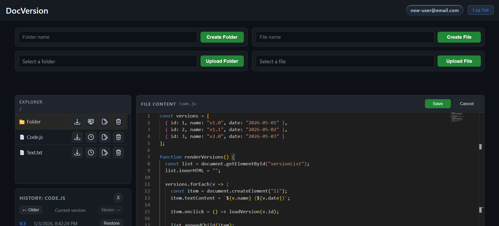
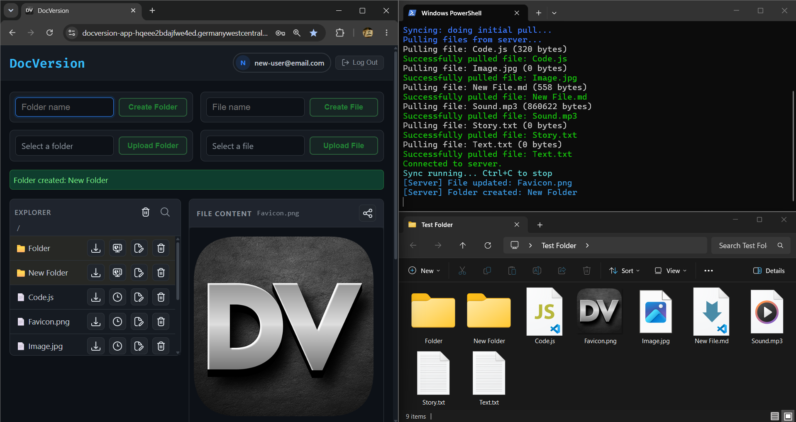

# DocVersion


<p align="center">
	
</p>

<p align="center">
	
</p>

<p align="center">
	
</p>

## Beskrivning

DocVersion är en komplett lösning för filhantering och versionshistorik. Systemet låter användare lagra, redigera och hantera dokument och filer på ett säkert sätt, där varje ändring automatiskt sparas som en ny version.

**Funktioner:** Ladda upp och ladda ner filer och mappar samt redigera filer direkt i webbläsaren. Skapa, hantera, byta namn på och ta bort filer och mappar. Visa tidigare versioner och återställ dem. Förhandsgranska textfiler, bilder, video, ljud, PDF, Excel och Word-dokument samt se ändringshistorik med möjlighet att navigera mellan versioner.

**Säkerhet:** Varje användare loggar in med e-post och lösenord. Du ser bara dina egna filer. Lösenord är hashade, sessioner förblir aktiva med automatisk tokenuppdatering, och inloggningar kan avslutas för att ta bort åtkomst.

**Realtid och synkronisering:** Alla ändringar uppdateras direkt för aktiva användare. Systemet återansluter automatiskt vid anslutningsbrott. Du kan synkronisera mappar och filer mellan din dator och servern via kommandoradsverktyg (pull, push, sync).

**Teknik:** Backend är byggd med ASP.NET Core, Entity Framework Core och Azure SQL Database. Filhantering sker via Azure Blob Storage. Applikationen körs i Azure App Service. Hemligheter och konfiguration hanteras via Azure Key Vault. Frontend är en webbapplikation med TypeScript. Inbyggd texteditor (Monaco) är integrerad lokalt. Autentisering använder JWT med access token och refresh token i HttpOnly-cookie. Realtidsuppdateringar sker via SignalR.

---

## Arkitektur

Projektet består av tre delar:

- **DocVersion.Server**: Webbservern som hanterar API, autentisering, filer och realtidskommunikation
- **DocVersion.Core**: Gemensam kod och hjälpfunktioner
- **DocVersion.Client**: CLI-verktyg för synkronisering mellan lokal dator och server

### Azure-baserad arkitektur

Systemet använder följande Azure-tjänster:

- **Azure App Service** → Hosting av backend API och webbläsargränssnitt
- **Azure SQL Database** → Databas för användare, metadata och versionshistorik
- **Azure Blob Storage** → Lagring av filer och filversioner
- **Azure Key Vault** → Säker lagring av connection strings, JWT-nycklar och secrets

---

### Server

- API för inloggning, filhantering och versioner
- Azure SQL Database via Entity Framework Core
- Filuppladdning och hämtning via Azure Blob Storage
- JWT-baserad autentisering
- SignalR för realtidsuppdateringar
- Säkerhetslager med rate limiting och token-revocation

---

### Webbläsargränssnitt

- Skrivet i TypeScript
- Bundlas till en enda JavaScript-fil
- SCSS för styling
- Monaco Editor hostas lokalt från servern
- Ingen extern CDN-användning

---

### Lagring och versionering

- Metadata lagras i Azure SQL Database
- Filer och versioner lagras i Azure Blob Storage
- Varje användares filer separeras logiskt i containers/folders
- Versionshistorik kopplas via databasen

---

## Komplett funktionell översikt

### Auth-funktioner

- Logga in med e-post och lösenord
- Registrera konto med validering
- Refresh token-flöde
- Logout och token-invalidation

---

### Filfunktioner

- Lista filer och mappar
- Visa filinnehåll eller mappinnehåll
- Hämta metadata via HEAD
- Skapa fil
- Skapa mapp
- Spara fil (inklusive tom fil), tangentbordskortkommando (Ctrl + S) eller save-knapp
- Ladda upp fil
- Ladda upp mapp
- Ladda ner fil
- Ladda ner mapp som zip
- Byta namn på fil eller mapp
- Ta bort fil eller mapp

### Versionsfunktioner

- Skapa ny version när filinnehåll ändras
- Lista versioner
- Öppna specifik historikversion
- Navigera historik med tangentbord (Ctrl + Z och Ctrl + Y)
- Återställ vald version

### Preview-funktioner

- Textpreview med radnummer
- Bildpreview
- Videopreview
- Ljudpreview
- PDF-preview
- Word-preview
- Excel-preview
- Binary fallback-meddelande för ej previewbara typer

### Realtidsfunktioner

- SignalR med Azure App Service
- Automatisk reconnect
- User-scoped events
- UI sync vid filändringar

---

## API-endpoints

### Auth: api/login
- POST /api/login
- POST /api/login/register
- POST /api/login/refresh
- POST /api/login/logout

### Filer: api/files
- GET /api/files
- GET /api/files/{path}
- HEAD /api/files/{path}
- POST /api/files/{path}
- PUT /api/files/{path}
- DELETE /api/files/{path}
- POST /api/files/rename
- GET /api/files/zip/{folder}
- POST /api/files/upload-folder

### Historik
- GET /api/files/history/{path}
- GET /api/files/history/{path}?version={n}
- POST /api/files/restore/{path}?version={n}

### SignalR
- Hub: /api/events/signalr

## DocVersion.Client: Synkroniseringssverktyg

DocVersion.Client är ett verktyg du kör från kommandoraden (terminal) för att automatiskt synkronisera mappar och filer mellan din dator och servern.

### Så här använder du det:

1. Bygg programmet som en körbar fil:

   ```powershell
   dotnet publish -c Release --self-contained true -p:PublishSingleFile=true
   ```

2. Gå till `Release` mappen i projektet och kopiera den skapade filen till en valfri mapp.

3. Lägg till den mappen i din miljövariabel (PATH) så att du kan köra kommandot från var som helst.

4. Öppna terminalen i den mapp du vill synkronisera med servern.

5. Kör ett av följande kommandon:
   - `DocVersion.Client pull <serverUrl> [email] [password]`
   - `DocVersion.Client push <serverUrl> [email] [password]`
   - `DocVersion.Client sync <serverUrl> [email] [password]`

Beteende:

- pull: laddar ner serverns filer/mappar och speglar lokalt
- push: laddar upp lokala filer/mappar till servern
- sync: kombinerar pull och push-flöden med event-baserad synklogik
- login sker om email och password skickas med

Exempel:

```powershell
DocVersion.Client pull http://localhost:3000 user@example.com MyPass123
DocVersion.Client push http://localhost:3000 user@example.com MyPass123
DocVersion.Client sync http://localhost:3000 user@example.com MyPass123
```

## Projektstruktur

```text
DocVersion/
├─ DocVersion.sln
├─ package.json
├─ package-lock.json
├─ .gitignore
├─ README.md
├─ DocVersion.Core/
│  ├─ Helpers/
│  └─ Models/
├─ DocVersion.Client/
│  └─ Program.cs
└─ DocVersion.Server/
	 ├─ Program.cs
	 ├─ appsettings.json
	 ├─ appsettings.Development.json
	 ├─ tsconfig.json
	 ├─ Controllers/
	 │  ├─ LoginController.cs
	 │  └─ FilesController.cs
	 ├─ Data/
	 │  └─ AppDbContext.cs
	 │  └─ DocVersion.db
	 ├─ Hubs/
	 │  └─ EventHub.cs
	 ├─ Models/
	 │  ├─ UserAccount.cs
	 │  └─ FileHistory.cs
	 ├─ Security/
	 │  ├─ JwtOptions.cs
	 │  ├─ JwtService.cs
	 │  └─ NameUserIdProvider.cs
	 ├─ Services/
	 │  └─ FileService.cs
	 ├─ src/
	 │  ├─ auth.ts
	 │  ├─ display.ts
	 │  ├─ files.ts
	 │  ├─ history.ts
	 │  ├─ index.ts
	 │  ├─ messages.ts
	 │  ├─ preview.ts
	 │  ├─ signalr.ts
	 │  ├─ state.ts
	 │  ├─ utils.ts
	 │  └─ styles.scss
	 └─ wwwroot/
			├─ index.html
			├─ css/
			├─ js/
			│  └─ vendor/
			│	  └─ scripts/
			│		 └─ sync-monaco.mjs
			└─ Assets/
```
## Lokal utveckling

### Krav
- .NET SDK 10
- Node.js och npm
- Azure resurser (eller emulatorer lokalt)

Steg 1: Installera allt som behövs

```powershell
npm install
```

Steg 2: Bygg frontend:

```powershell
npm run build
```

Steg 3: Bygg CSS:

```powershell
npx sass DocVersion.Server/src/styles.scss DocVersion.Server/wwwroot/css/styles.css --no-source-map
```

Steg 4: Bygg backend:

```powershell
dotnet build DocVersion.Server/DocVersion.Server.csproj -c Release
```

Steg 5: Starta servern

```powershell
cd DocVersion.Server
dotnet run
```
## Deployment

**Automatisk deploy (PowerShell)**

Projektet innehåller även en deploy-fil för enklare distribution:

```powershell
./deploy.ps1
```
## Konfiguration

Servern behöver en hemlig nyckel för att kryptera inloggningar. Den söker efter den här:

1. Miljövariabel JWT_KEY (bäst)
2. Inställningen Jwt:Key i appsettings-filen

Rekommendation: Sätt JWT_KEY som miljövariabel istället för hemlig nyckel i filer.

## Säkerhet

- PasswordHasher för hash och verify
- JWT med validering av issuer, audience, lifetime och signing key
- Refresh token i HttpOnly-cookie med SameSite=Strict
- RefreshTokenVersion för revocation vid logout
- Rate limiter för auth
- Eventflöde scoped per användare i SignalR

## English Summary

DocVersion is a cloud-based document management system that provides file storage with full version history. It allows users to upload, edit, download, and organize files and folders through a web interface. Every change is automatically saved as a new version, making it possible to restore previous states at any time.

The system is secure and uses authentication with login and password. It also supports real-time updates so that all changes are instantly reflected for active users.

The backend is hosted on Azure App Service and uses Azure SQL Database for storing metadata and version history. Files are stored in Azure Blob Storage, and sensitive configuration such as connection strings and security keys are managed securely using Azure Key Vault.

## Utvecklare

Alaa Alsous
